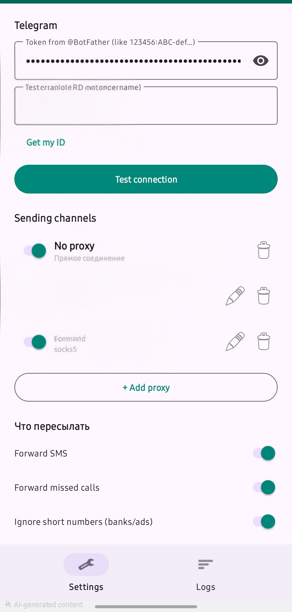

# 📱 SMS Forwarder — Android → Telegram

> Пересылает входящие SMS и пропущенные вызовы с Android в Telegram.
> Работает в фоне **без всплывающих уведомлений**, не выгружается системой.
> Поддержка HTTP/SOCKS5 прокси для обхода блокировок.


---

## 📸 Скриншот



---

## 🚀 Возможности

- 📩 **SMS** — мгновенно, с именем отправителя из контактов
- 📵 **Пропущенные вызовы** — только реально не отвеченные
- 🚫 **Без всплывающих уведомлений** — невидимый канал, не мешает
- 🌙 **Работает в фоне** — автозапуск после перезагрузки, защита от выгрузки
- 🔒 **Токен в приложении** — вводите в UI, хранится зашифрованным
- 🌐 **Прокси** — HTTP / SOCKS5 для обхода блокировок Telegram
- 🔄 **Надёжность** — очередь с ретраями (backoff до 5 мин)

---

## 📥 Установка

Скачайте последний **release APK** со страницы [Releases](https://github.com/ozyab09/sms-forwarder/releases).

> ⚠️ Приложение не в Google Play — установите APK вручную (разрешите «Неизвестные источники»).

---

## ⚙️ Быстрый старт (3 шага)

### 1. Создайте бота
Откройте [@BotFather](https://t.me/BotFather) в Telegram → `/newbot` → получите **токен** (вроде `123456789:ABC...`).

### 2. Введите токен в приложении
Откройте SMS Forwarder → вставьте токен → нажмите **«Проверить связь»**.

### 3. Получите Chat ID
Напишите боту `/start` → в приложении нажмите **«Получить мой ID»** → готово!

---

## 🔧 Настройки

| Настройка | Описание |
|-----------|----------|
| **Токен бота** | Обязательно. Из @BotFather. Хранится зашифрованным. |
| **Chat ID** | Ваш числовой ID в Telegram. Кнопка «Получить мой ID» заберёт его автоматически. |
| **Прокси** | Опционально. Тип (HTTP/SOCKS5), хост, порт, логин/пароль. Кнопка «Проверить подключение». |
| **Переключатели** | Вкл/выкл SMS, вызовы, фильтр коротких номеров. |
| **Статус** | Запуск/остановка сервиса, счётчик, последние события. |

---

## 🛡️ Приватность и безопасность

- **SMS и номера не покидают телефон** — только через ваш бот в Telegram
- **Токен зашифрован** — `EncryptedSharedPreferences` (AES-256)
- **Нет логов** — только последние 10 событий в памяти приложения
- **Нет аналитики, трекеров, рекламы** — полностью локально

---

## 📦 Сборка (для разработчиков)

Требования: **JDK 17**, **Android SDK 34**.

```bash
# Debug APK (для тестов):
./gradlew assembleDebug

# Тесты + линтер:
./gradlew testDebugUnitTest lintDebug

# Release APK (подписанный; секреты через env):
./gradlew assembleRelease
```

---

## 🔄 CI/CD (GitHub Actions)

| Событие | Что происходит |
|---------|----------------|
| Pull Request | Debug APK + тесты + lint (артефакт) |
| Тег `vX.Y.Z` | Подписанный Release APK + **GitHub Release** с changelog |

Версия берётся из тега (`GITHUB_REF_NAME`). `versionCode` = `major*10000 + minor*100 + patch`.

**Секреты репозитория** (Settings → Secrets → Actions):

| Секрет | Назначение |
|--------|-----------|
| `KEYSTORE_BASE64` | Keystore для подписи (base64) |
| `KEYSTORE_PASSWORD` | Пароль keystore |
| `KEY_ALIAS` | Алиас ключа |
| `KEY_PASSWORD` | Пароль ключа |

---

## 🏗️ Архитектура (кратко)

```
UI (MainActivity) → EncryptedSharedPreferences
        │
SmsReceiver / CallReceiver / BootReceiver
        │
ForwardService (Foreground, START_STICKY)
        ├── очередь + ретраи
        └── TelegramClient → Bot API (HTTPS + proxy)
```

---

## 🛡️ Права доступа

`RECEIVE_SMS` · `READ_PHONE_STATE` · `READ_CALL_LOG` · `READ_CONTACTS` ·
`INTERNET` · `FOREGROUND_SERVICE` · `RECEIVE_BOOT_COMPLETED` ·
`REQUEST_IGNORE_BATTERY_OPTIMIZATIONS`

---

## 📁 Структура проекта

```
sms-forwarder/
├── app/src/main/java/com/ozyab/smsforwarder/
│   ├── ui/          # MainActivity (настройки + статус)
│   ├── receiver/    # SmsReceiver, CallReceiver, BootReceiver
│   ├── service/     # ForwardService (фон + очередь)
│   ├── telegram/    # TelegramClient, ProxyConfig
│   └── util/        # Prefs, ContactNames
├── app/src/main/res/           # layout, strings, темы, иконки
├── app/src/test/               # юнит-тесты
├── gradle/                     # wrapper, libs.versions.toml
├── .github/workflows/build.yml # CI/CD + SemVer релизы
├── docs/
│   ├── TECH_TASK.md            # полное ТЗ
│   └── screenshots/            # скриншоты (добавить позже)
├── AGENTS.md                   # техническая документация для разработчиков
├── CHANGELOG.md
└── README.md
```

---

## ⚖️ Лицензия

MIT — личный проект.

---

_Подробное ТЗ: [`docs/TECH_TASK.md`](docs/TECH_TASK.md) · Для разработчиков: [`AGENTS.md`](AGENTS.md)_